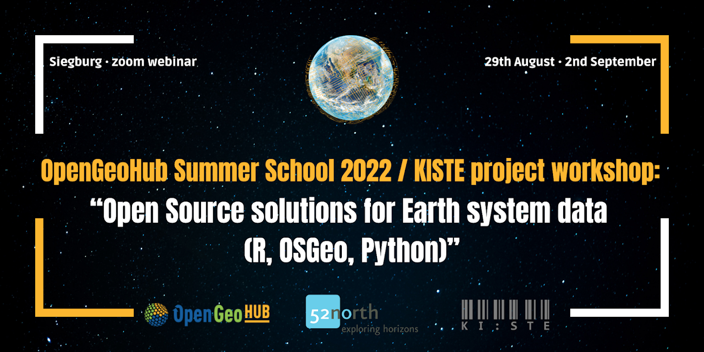

## [**28 August -- 03 September 2022, OpenGeoHub Summer School 2022, Siegburg**](https://opengeohub.org/summer-school/siegburg-2022/)

### Tom Hengl: “Modern challanges of geospatial data science: the Open-Earth-Monitor project”

- [Video](https://doi.org/10.5446/59400)

### Ben Graeler: “AI Strategy for Earth System Data – KI:STE project”
### Martin Schultz: “Machine learning for weather, air quality and climate”

- [Video](https://doi.org/10.5446/59411)
- [Workshop materials](https://b2drop.eudat.eu/s/GCyCgxPe3Wwpzpe)

### Markus Konkol: “Open Reproducible Research – Concepts, challenges, and solutions”

- [Video](https://doi.org/10.5446/59403)
- [Slides](https://github.com/Nowosad/OGH_summer_school_2022/raw/main/resources/open_reproducible_research.pdf)

### Jakub Nowosad: “Geocomputation with R’s guide to reproducible spatial data analysis”

- [Video](https://doi.org/10.5446/59404)
- [Slides](https://jakubnowosad.com/ogh2022/)

### Edzer Pebesma: “R-spatial updates: sf, sftime, stars”

- [Video part I](https://doi.org/10.5446/59401)
- [Video part II](https://doi.org/10.5446/59406)
- [Workshop materials](https://github.com/edzer/OGH22)

### Christian Autermann: “GeoNode as Research Data Infrastructure”
### Martijn Visser; Maarten Pronk: “JuliaGeo: a gentle introduction”

- [Video](https://doi.org/10.5446/59405)
- [Workshop materials](https://github.com/evetion/OGH2022)

### Martin Fleischmann: “Introduction to GeoPandas and its Python ecosystem” 

- [Video](https://doi.org/10.5446/59414)
- [Workshop materials](https://github.com/martinfleis/opengeohub2022-tutorial)

### Krzystof Dyba: “Benchmarking R and Python for spatial data processing”

- [Video](https://doi.org/10.5446/59407)
- [Workshop materials](https://github.com/kadyb/OGH2022)

### Ben Graeler: “Extreme events session”

- [Workshop materials](https://github.com/BenGraeler/ogh2022)

### Leandro Parente: “Accessing and using data cubes: spatial overlay, visualization and modeling – Python tutorial”

- [Video](https://doi.org/10.5446/59408)
- [Workshop materials](https://gitlab.com/leal.parente/geo-snippets/-/blob/main/data_cubes/Accessing_and_using_data_cubes_summer_school_2022.ipynb)

### Markus Abel: “Stochastic processes, analysis, examples (Python tutorial)”

- [Video](https://doi.org/10.5446/59416)

### Edzer Pebesma & Leandro Parente: “Geo-arrow and geo-parquet”

- [Video](https://doi.org/10.5446/59418)
- [Workshop materials #1](https://edzer.github.io/OGH22/columnar.html)
- [Workshop materials #2](https://gitlab.com/leal.parente/geo-snippets/-/blob/main/lidar/icesat2_atl08.ipynb)

### Ribana Roscher: “Explainable ML”

- [Video](https://doi.org/10.5446/59417)
- [Slides #1](https://github.com/Nowosad/OGH_summer_school_2022/raw/main/resources/lecture-KISTE_SS_roscher_partI.pdf)
- [Slides #2](https://github.com/Nowosad/OGH_summer_school_2022/raw/main/resources/lecture-KISTE_SS_roscher_partII.pdf)

### Patrick Schratz: “Introduction to mlr3 (R tutorial)” and Patrick Schratz & Leandro Parente: “Spatial modeling using mlr3 (R tutorial)”

- [Video](https://doi.org/10.5446/59409)
- [Workshop materials #1](https://github.com/mlr-org/opengeohub-summer-school-2022)
- [Workshop materials #2](https://gitlab.com/leal.parente/geo-snippets/-/tree/main/mlr3)

### Hanna Meyer: “ML in R: how to deal with extrapolation and overfitting problems”

- [Video](https://doi.org/10.5446/59412)
- [Workshop materials](https://github.com/HannaMeyer/OpenGeoHub_2022)

### Tim Appelhans: “Visualization cloud-optimized (large) datasets in R (R tutorial)”

- [Video](https://doi.org/10.5446/59410)
- [Workshop materials #1](https://cn-raster-data-vis.s3.eu-central-1.amazonaws.com/cn-raster-data-vis.html)
- [Workshop materials #2](https://cn-vector-data-vis.s3.eu-central-1.amazonaws.com/cn-vector-data-vis.html)
- [Workshop materials #3](https://cn-data-creation.s3.eu-central-1.amazonaws.com/cloud_optimised_data.html)

### Other

- [Hackathon instructions](https://gitlab.com/leal.parente/geo-snippets/-/blob/main/hackathon/pasture_classification_summer_school_2022.ipynb)
- [Winning hackathon submission by Francisco Zambrano](https://frzambra.github.io/Hackaton1/report_hack1.html)
